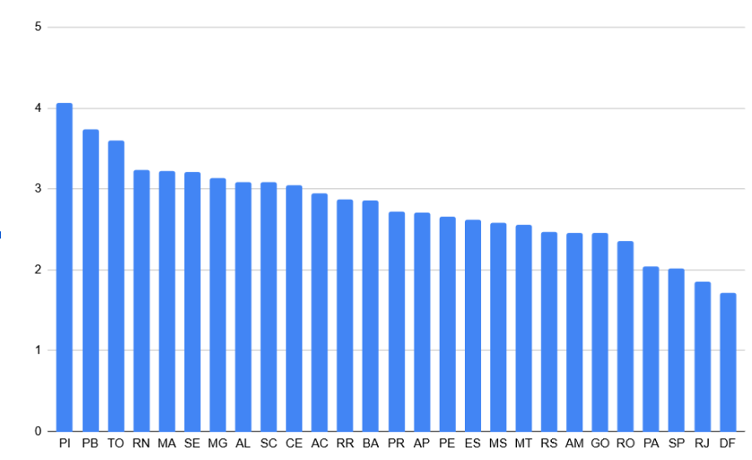

# Análise da Cobertura da Atenção Básica no SUS (2020)

##  Ranking de estados

##  Principais descobertas

- **Piauí** lidera a cobertura com 4,05 equipes por 10 mil habitantes
- **Distrito Federal** tem a menor cobertura (1,25)
- Diferença entre o primeiro e o último: **3,2x menos equipes**
---
## Padrões Identificados

### Nordeste lidera a cobertura

Dos 10 estados com maior cobertura, 6 pertencem à região Nordeste com 41% do total de equipes:

| Posição | Estado | Região | Equipes por 10k |
|---------|--------|--------|-----------------|
| 1º | Piauí | Nordeste | 4,05 |
| 2º | Paraíba | Nordeste | 3,65 |
| 4º | Rio Grande do Norte | Nordeste | 3,25 |
| 5º | Maranhão | Nordeste | 3,22 |
| 6º | Sergipe | Nordeste | 3,21 |
| 8º | Alagoas | Nordeste | 3,08 |

Enquanto isso, os estados do Sudeste aparecem nas últimas posições com apenas 10%:

| Posição | Estado | Região | Equipes por 10k |
|---------|--------|--------|-----------------|
| 24º | São Paulo | Sudeste | 1,45 |
| 25º | Rio de Janeiro | Sudeste | 1,35 |
---
##  Tecnologias
- SQL (BigQuery)
- Google Sheets (visualização)

##  Arquivos
- `ranking_estados.sql` - Query utilizada
- `final.png` - Gráfico final
